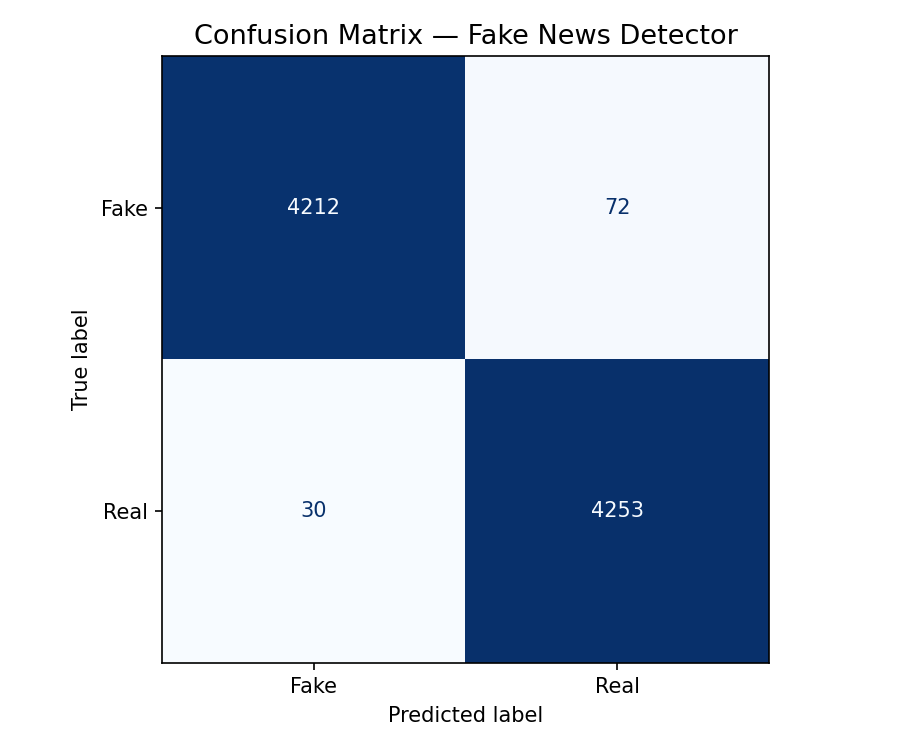
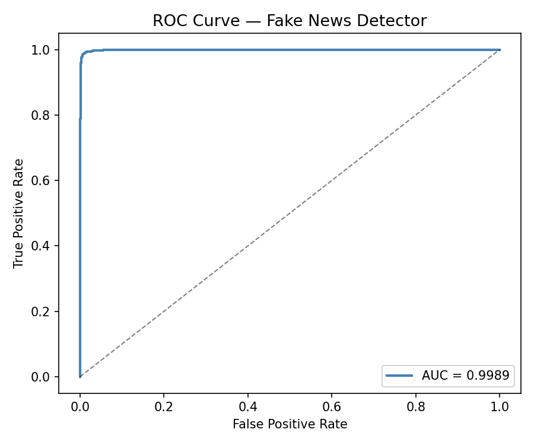

# 📰 Fake News Detector

An end-to-end Machine Learning system that detects whether a news article is **Fake** or **Real** using NLP, real-time news verification, and explainable AI.

> Built as a production-grade ML engineering project — not just a notebook.

---

## 🏆 Model Performance

| Metric | Score |
|---|---|
| Test Accuracy | ~98% |
| ROC-AUC | ~99% |
| CV Accuracy (5-fold) | ~98% ± 0.002 |

<p float="left">
  
  
</p>

---

## ✨ Features

- 🧠 **ML model** — SGDClassifier with TF-IDF (n-grams 1–3, 20k features)
- 🔀 **Hybrid verdict** — fuses ML confidence + real-time news similarity (50/50 weighted)
- 🔍 **Explainable AI** — LIME highlights which words drove the prediction (red = fake signal, green = real signal)
- 🌐 **Live news verification** — Google News RSS search for corroborating articles
- ⚡ **FastAPI backend** — `/predict` and `/explain` endpoints with structured logging
- 🎨 **Streamlit frontend** — interactive UI with confidence scores and highlighted text
- 🛠️ **sklearn Pipeline** — vectorizer + model packaged together, no train/serve mismatch

---

## 🏗️ Project Structure

```
fake-news-detector/
│
├── app/
│   └── streamlit_app.py      # Frontend UI
│
├── api/
│   └── main.py               # FastAPI backend (v3)
│
├── src/
│   ├── train.py              # Model training + evaluation artifacts
│   ├── predict.py            # Prediction logic
│   ├── explain.py            # LIME + TF-IDF explainability
│   └── news_fetcher.py       # Google News RSS integration
│
├── data/
│   ├── fake.csv
│   └── true.csv
│
├── models/
│   ├── pipeline.pkl          # Full sklearn Pipeline (vectorizer + model)
│   ├── model.pkl             # Model only (backward compat)
│   └── vectorizer.pkl        # Vectorizer only (backward compat)
│
├── reports/
│   ├── confusion_matrix.png  # Generated by train.py
│   ├── roc_curve.png         # Generated by train.py
│   └── metrics.json          # Generated by train.py
│
├── .env.example              # Environment variable template
├── requirements.txt          # Pinned dependencies
└── README.md
```

---

## ⚙️ How the Verdict Works

Each prediction combines **two independent signals**:

```
Final Score = 0.5 × ML confidence + 0.5 × News similarity score

≥ 65%  →  Real
40–65% →  Unverified
< 40%  →  Likely Fake
```

**Override rules** (when signals strongly agree):
- ML fake confidence > 80% AND similarity < 25% → force **Likely Fake**
- ML real confidence > 80% AND similarity > 55% → force **Real**

---

## 🔍 Explainable AI (LIME)

The `/explain` endpoint uses [LIME](https://github.com/marcotcr/lime) to explain predictions at the word level.

LIME works by perturbing the input (randomly masking words) and observing how the model's prediction changes. Words whose removal flips the verdict get high weight.

**Example output:**
- 🔴 `hoax`, `conspiracy`, `unverified` → push toward Fake
- 🟢 `reuters`, `confirmed`, `official` → push toward Real

---

## 🚀 Running Locally

**1. Clone and set up environment**
```bash
git clone https://github.com/your-username/fake-news-detector.git
cd fake-news-detector
python -m venv ml_env
ml_env\Scripts\activate      # Windows
# source ml_env/bin/activate  # Mac/Linux
pip install -r requirements.txt
```

**2. Configure environment**
```bash
cp .env.example .env
# Edit .env — set API_URL if deploying remotely
```

**3. Train the model**
```bash
python src/train.py
# Generates models/pipeline.pkl and reports/
```

**4. Start the backend**
```bash
uvicorn api.main:app --reload
```

**5. Start the frontend**
```bash
streamlit run app/streamlit_app.py
```

---

## 🌐 API Reference

### `POST /predict`
```json
{ "text": "NASA confirms moon landing was staged by Hollywood." }
```
Returns verdict, confidence score, ML details, news similarity, and related articles.

### `POST /explain`
```json
{ "text": "...", "use_lime": true }
```
Returns top fake/real words with weights and highlighted HTML.

### `GET /health`
Returns `{ "status": "ok", "version": "3.0" }`.

---

## 🌱 Future Improvements

- [ ] Upgrade to BERT-based model (DistilBERT fine-tuning)
- [ ] Source credibility scoring (whitelist/blacklist domains)
- [ ] Store predictions in PostgreSQL for analytics
- [ ] Cloud deployment on AWS / Render with CI/CD
- [ ] Docker containerization

---

## 💡 Key Learnings

- End-to-end ML pipeline with train/serve consistency (same `preprocess()` in both)
- Why sklearn `Pipeline` prevents data leakage
- How LIME generates local explanations for black-box models
- Hybrid decision systems combining ML + external data signals
- Production API patterns: structured logging, Pydantic validation, health checks

---

## 👨‍💻 Author

**Bhumik Kumta** — built as an ML Engineering portfolio project.
